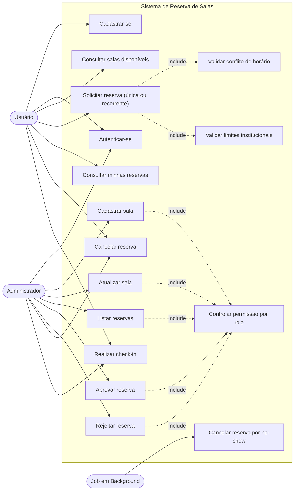

# Diagrama de Casos de Uso

## Atores

- **Usuário**: pessoa que consulta salas, solicita reservas, faz check-in e acompanha seus agendamentos.
- **Administrador**: pessoa responsável por manter salas, aprovar/rejeitar reservas e isenta de limites.
- **Job em Background**: rotina automatizada (APScheduler) do sistema que executa tarefas recorrentes.

## Casos de uso principais

- **Cadastrar-se**: cria uma conta com email e senha.
- **Autenticar-se**: gera token JWT para acessar rotas protegidas.
- **Consultar salas disponíveis**: lista salas ativas, com filtro opcional por capacidade.
- **Solicitar reserva (única ou recorrente)**: cria uma reserva (ou várias, se for recorrente) com status inicial `pending`.
- **Consultar minhas reservas**: lista reservas do usuário autenticado.
- **Cancelar reserva**: altera uma reserva para `canceled`.
- **Cadastrar sala**: cria uma sala, permitido apenas para admin.
- **Atualizar sala**: altera dados da sala, permitido apenas para admin.
- **Listar reservas**: consulta administrativa das reservas.
- **Aprovar reserva**: muda reserva `pending` para `approved`.
- **Rejeitar reserva**: muda reserva `pending` para `rejected`.
- **Realizar check-in**: usuário confirma presença no horário da reserva aprovada.
- **Cancelar reserva por no-show**: o job cancela automaticamente reservas aprovadas sem check-in após tolerância.
- **Validar conflito de horário**: impede double booking para reservas (verifica conflitos em todas as ocorrências de reservas recorrentes).
- **Validar limites institucionais**: impede que usuários (perfil `user`) excedam reservas ativas, limite diário de horas ou tempo máximo por reserva.
- **Controlar permissão por role**: bloqueia rotas administrativas para usuários comuns.
