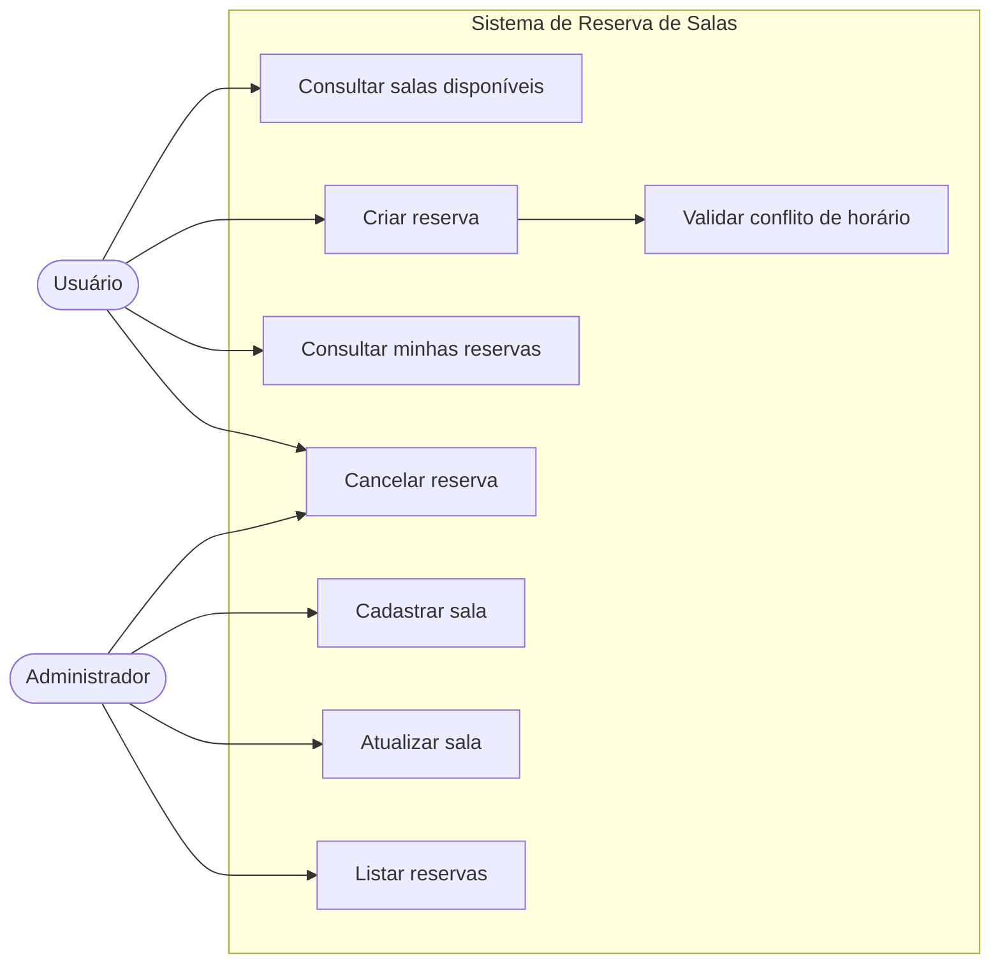

# Diagrama de Casos de Uso

## Atores

- Usuário: pessoa que consulta salas, cria reservas e acompanha seus agendamentos.
- Administrador: pessoa responsável por manter o cadastro de salas e acompanhar reservas do sistema.

## Casos de uso principais

- Consultar salas disponíveis: permite filtrar salas por capacidade e período.
- Criar reserva: registra uma reserva para uma sala em um intervalo de horário.
- Consultar minhas reservas: lista reservas vinculadas a um usuário.
- Cancelar reserva: altera uma reserva ativa para cancelada.
- Cadastrar sala: cria uma sala com nome, capacidade e localização.
- Atualizar sala: altera dados cadastrais de uma sala.
- Listar reservas: permite consulta administrativa das reservas.
- Validar conflito de horário: regra interna chamada ao criar uma reserva.
