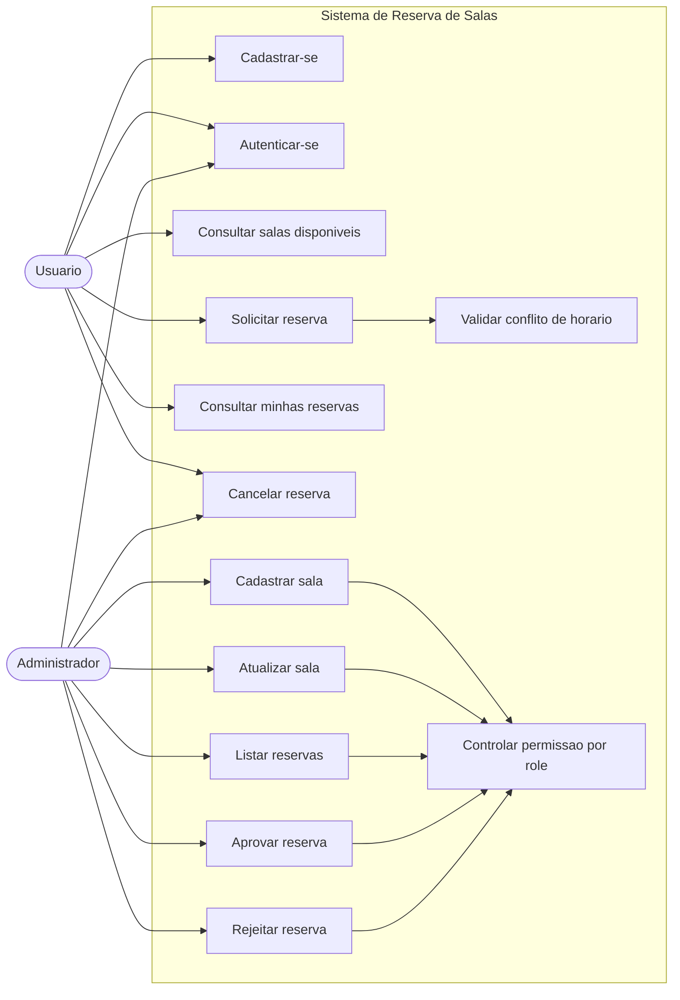

# Diagrama de Casos de Uso

## Atores

- Usuario: pessoa que consulta salas, solicita reservas e acompanha seus agendamentos.
- Administrador: pessoa responsavel por manter salas e aprovar ou rejeitar reservas.

## Casos de uso principais

- Cadastrar-se: cria uma conta com email e senha.
- Autenticar-se: gera token JWT para acessar rotas protegidas.
- Consultar salas disponiveis: lista salas ativas, com filtro opcional por capacidade.
- Solicitar reserva: cria uma reserva com status inicial `pending`.
- Consultar minhas reservas: lista reservas do usuario autenticado.
- Cancelar reserva: altera uma reserva para `canceled`.
- Cadastrar sala: cria uma sala, permitido apenas para admin.
- Atualizar sala: altera dados da sala, permitido apenas para admin.
- Listar reservas: consulta administrativa das reservas.
- Aprovar reserva: muda reserva `pending` para `approved`.
- Rejeitar reserva: muda reserva `pending` para `rejected`.
- Validar conflito de horario: impede double booking para reservas `pending` ou `approved`.
- Controlar permissao por role: bloqueia rotas administrativas para usuarios comuns.
